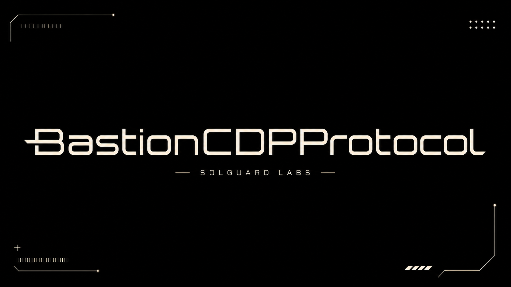
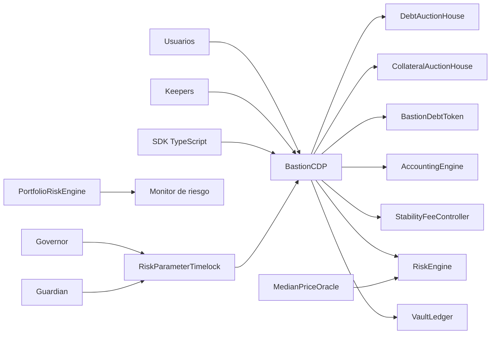
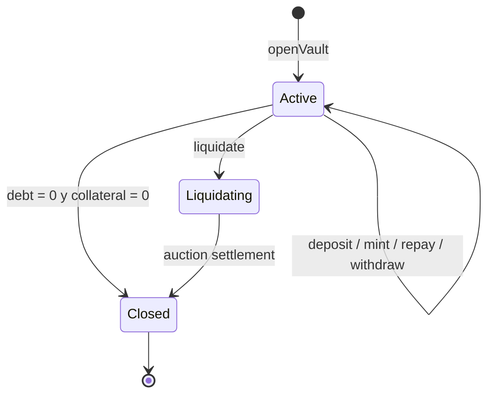
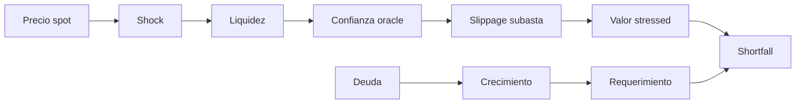
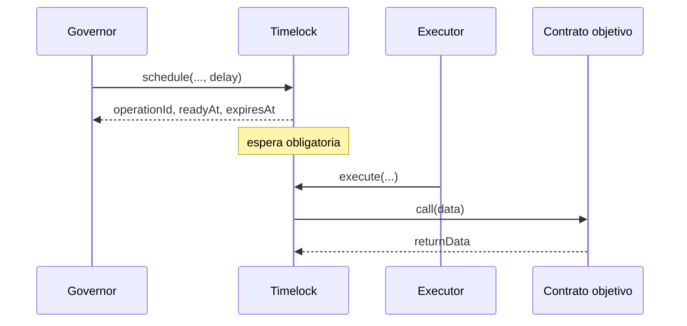

# BastionCDPProtocol



BastionCDPProtocol es un sistema de posiciones de deuda colateralizada escrito en Solidity. Permite
emitir `bUSD` contra garantía volátil, acumular stability fees, liquidar posiciones fuera de ratio y
recapitalizar mediante subastas de deuda.

La versión `1.0.0` incorpora un motor de stress de cartera, concentración HHI, gobierno temporal de
parámetros, SDK TypeScript de precisión exacta y una cadena de release reproducible.

## Capacidades

- vaults aislados por propietario y tipo de garantía;
- configuración de ratio, penalty, debt ceiling, mínimo y frescura por activo;
- índice RAY de stability fee con evolución temporal;
- validación de salud y precio de liquidación;
- subastas de garantía pagadas mediante burn de `bUSD`;
- subastas de deuda con emisión de acciones `BRS`;
- accounting agregado y por colateral;
- escenarios de stress secuenciales;
- concentración HHI de deuda y garantía;
- timelock con predecesores, cancelación, expiración y calldata enlazado;
- SDK `bigint` para lectura y simulación económica.

## Arquitectura



| Capa         | Módulos                                      | Función                        |
| ------------ | -------------------------------------------- | ------------------------------ |
| Protocolo    | `BastionCDP`                                 | Orquestación y custodia        |
| Estado       | `VaultLedger`, `AccountingEngine`            | Posiciones y agregados         |
| Riesgo       | `RiskEngine`, `PortfolioRiskEngine`          | Admisión y stress              |
| Precio       | `MedianPriceOracle`                          | Precio y timestamp             |
| Deuda        | `BastionDebtToken`, `StabilityFeeController` | Supply e índice                |
| Recuperación | `CollateralAuctionHouse`, `DebtAuctionHouse` | Liquidación y recapitalización |
| Control      | `RiskParameterTimelock`, roles               | Gobierno retardado             |
| Integración  | `BastionLens`, SDK                           | Lecturas y simulación          |

## Ciclo de un vault



1. El usuario abre un vault para un colateral habilitado.
2. Deposita garantía y emite `bUSD` dentro del ratio y ceiling.
3. El índice global acumula el coste temporal.
4. El usuario reduce deuda o retira garantía conservando salud.
5. Si el ratio cae, un keeper inicia la liquidación.
6. La garantía pasa al auction house y se ofrece a cambio de `bUSD` quemado.
7. El bad debt restante puede cubrirse con una subasta de `BRS`.

## Modelo económico

Las unidades son:

```text
WAD = 1e18      importes y precios
RAY = 1e27      índices
BPS = 10_000    ratios
```

Valor y capacidad:

```text
collateralValue = floor(collateralAmount × price / WAD)
maxDebt         = floor(collateralValue × BPS / liquidationRatioBps)
liquidationDebt = debt + ceil(debt × penaltyBps / BPS)
```

Fee por índice:

```text
nextIndex  = index + floor(index × annualRateBps × elapsed / (BPS × YEAR))
pendingFee = ceil(debt × nextIndex / vaultIndex) - debt
```

Consulta [modelo-economico.md](./docs/modelo-economico.md) para ejemplos de redondeo, subastas y
reconciliación.

## Riesgo de cartera

`PortfolioRiskEngine` aplica, en orden:

1. shock de precio;
2. haircut efectivo de liquidez;
3. desviación efectiva de oracle;
4. slippage de subasta;
5. crecimiento de deuda.



El resultado incluye:

- valor spot y stressed;
- deuda efectiva y requerimiento de liquidación;
- shortfall y capital en riesgo;
- utilización del debt ceiling;
- HHI de deuda y garantía;
- mayor participación individual;
- cobertura y score agregado;
- digest reproducible del escenario.

Los identificadores de colateral deben enviarse ordenados ascendentemente.

## Gobierno

`RiskParameterTimelock` enlaza cada cambio a cadena, contrato, target, value, hash de calldata,
predecesor y salt.



El guardian puede cancelar una operación pendiente. Cambiar delay o grace period requiere una
operación programada contra el propio timelock.

## SDK TypeScript

El SDK usa `bigint` y no depende de un proveedor RPC concreto.

```ts
import { BastionClient, evaluatePortfolio, parseUnits, type Address } from "./sdk/BastionClient.js";

const address = "0x1111111111111111111111111111111111111111" as Address;
const client = new BastionClient(address, reader);

const view = await client.vaultView(42n);
const amount = parseUnits("1250.50");
const risk = evaluatePortfolio(exposures, scenario, limits);
```

Funciones matemáticas:

- parsing y formato exactos;
- `mulDiv` y `mulDivUp`;
- accrual RAY;
- precio y deuda de liquidación;
- stress secuencial;
- evaluación agregada;
- serialización de `bigint`.

Consulta [integracion.md](./docs/integracion.md) para el adaptador y snapshots a un único bloque.

## Requisitos

- Foundry con Solidity `0.8.26`;
- Node.js `24`;
- npm `11`.

La validación local de esta versión usa Foundry `1.7.1`.

## Inicio rápido

```bash
forge install --no-git --shallow foundry-rs/forge-std
forge build --deny warnings
forge test --deny warnings

npm ci
npm run build:sdk
npm test
```

Puerta completa:

```bash
bash scripts/ci.sh
```

En PowerShell:

```powershell
.\scripts\ci.ps1
```

## Tests

La suite cubre:

- lifecycle de vaults;
- emisión, repago y retirada;
- liquidación y compra de garantía;
- recapitalización con `BRS`;
- stress, shortfall, HHI y cobertura;
- timelock, predecesores, expiración y cancelación;
- metadata de versión;
- aritmética equivalente en TypeScript;
- estructura, narrativa y banner del repositorio.

El perfil CI eleva fuzzing a 2.048 runs e invariantes a 512 runs con profundidad 64.

## Estructura

```text
src/
  access/          roles
  auctions/        subastas de garantía y deuda
  core/            ledger, accounting, fees y límites
  governance/      timelock de parámetros
  interfaces/      contratos externos
  libraries/       aritmética y transferencias
  oracle/          precios
  periphery/       vistas agregadas
  risk/            stress de cartera
  tokens/          bUSD, BRS y garantía
  types/           estructuras compartidas
  version/         metadata de release
sdk/               cliente y modelo TypeScript
script/            despliegues Foundry
tests/             unitarios e integración
docs/              documentación técnica
```

## Documentación

- [Arquitectura](./docs/arquitectura.md)
- [Modelo económico](./docs/modelo-economico.md)
- [Modelo de seguridad](./docs/modelo-seguridad.md)
- [Gobierno](./docs/gobierno.md)
- [Operaciones](./docs/operaciones.md)
- [Integración](./docs/integracion.md)
- [Despliegue](./docs/despliegue.md)
- [Política de seguridad](./SECURITY.md)

## Release

La versión estable es `Production 1.0.0`, identificada por el tag anotado `v1.0.0`. La release exige
paridad exacta entre `main`, `production` y el objeto pelado del tag, además de CI e integridad
verdes.

## Licencia

MIT. Consulta [LICENSE](./LICENSE).
