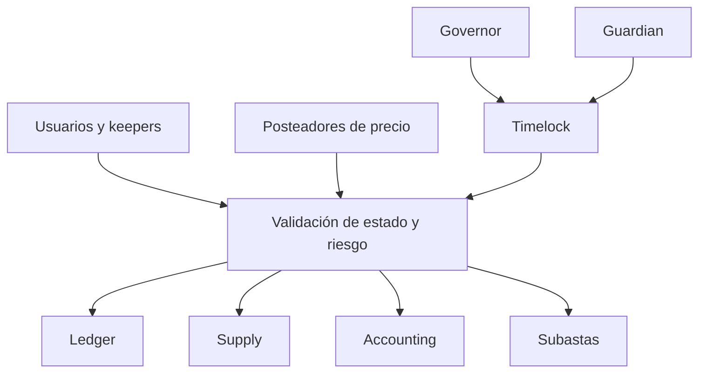
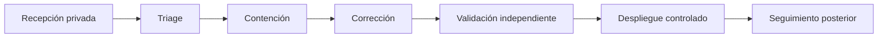

# Política de seguridad

## Alcance

Esta política cubre el código y configuración mantenidos en este repositorio:

- contratos bajo `src/`;
- scripts de despliegue bajo `script/`;
- SDK TypeScript bajo `sdk/`;
- tests y scripts de validación;
- workflows de integración y release.

No cubre proveedores RPC, custodios de claves, frontends externos, tokens no incluidos ni
infraestructura de terceros.

## Versiones

| Versión   | Estado       | Actualizaciones de seguridad |
| --------- | ------------ | ---------------------------- |
| `1.0.x`   | Soportada    | Sí                           |
| `< 1.0.0` | No soportada | No                           |

La versión se verifica mediante `BastionVersion.release()`, `package.json` y el tag anotado
correspondiente.

## Modelo de confianza



Se asume que:

- las cuentas con roles se gestionan según su propósito;
- el oracle entrega unidades y timestamps correctos;
- los collaterals admitidos respetan el comportamiento aprobado;
- los keepers pueden operar dentro de las ventanas previstas;
- la red ejecuta Solidity `0.8.26` con semántica Cancun.

## Invariantes prioritarias

### Custodia

- la garantía de vaults activos permanece en `BastionCDP`;
- la garantía liquidada permanece en `CollateralAuctionHouse` hasta venta o settlement;
- ninguna retirada supera la cantidad registrada;
- las transferencias usan destinatarios no nulos.

### Deuda

- la emisión respeta ratio y ceiling;
- el burn reduce supply por el importe ejecutado;
- accounting por colateral suma al agregado global;
- la recuperación de una subasta no supera su deuda inicial;
- bad debt sólo disminuye mediante una recuperación registrada.

### Precio y riesgo

- precio cero o caducado no autoriza operaciones sensibles;
- ratios usan BPS y precios/importes usan WAD;
- deuda exigible redondea hacia arriba;
- valor recuperable redondea hacia abajo;
- escenarios agregados usan orden canónico.

### Gobierno

- target, value y calldata ejecutados coinciden con la operación programada;
- el delay mínimo no puede omitirse;
- un predecesor debe estar ejecutado;
- una operación cancelada, expirada o ejecutada no puede repetirse;
- los tiempos del timelock sólo cambian mediante autoejecución.

## Matriz de roles

| Rol                  | Acción                      | Custodia recomendada       |
| -------------------- | --------------------------- | -------------------------- |
| `DEFAULT_ADMIN_ROLE` | roles y ownership           | multisig fría              |
| `RISK_MANAGER_ROLE`  | parámetros de riesgo        | timelock                   |
| `GOVERNOR_ROLE`      | programar operaciones       | multisig de riesgo         |
| `EXECUTOR_ROLE`      | ejecutar operaciones listas | automatización restringida |
| `GUARDIAN_ROLE`      | cancelar operaciones        | multisig de respuesta      |
| `PAUSER_ROLE`        | pausar rutas                | guardia operativa          |
| `ORACLE_POSTER_ROLE` | publicar precios            | servicio dedicado          |
| `AUCTIONEER_ROLE`    | recapitalización            | keeper autorizado          |

El administrador no debe usarse como cuenta diaria. La transferencia y revocación de roles se
ensayan antes de cada despliegue.

## Defensa por capas

1. ownership y roles;
2. validación de importes y destinatarios;
3. precio con frescura;
4. ratio, minimum debt y ceiling;
5. guardia de reentrada;
6. accounting y eventos;
7. stress de cartera;
8. timelock y guardian;
9. reconciliación operativa;
10. CI e integridad de release.

## Prácticas de integración

- usar el mismo block tag para una vista completa;
- conservar importes como `bigint`;
- verificar chain id y dirección antes de firmar;
- limitar allowances;
- simular la transacción final;
- rechazar precios locales sin timestamp;
- decodificar custom errors;
- no reintentar automáticamente transacciones mutables;
- comparar ledger, supply, balances y accounting.

## Validación

```bash
forge fmt --check
forge build --deny warnings
FOUNDRY_PROFILE=ci forge test --deny warnings
npm ci
npm run ci:sdk
```

Los cambios económicos deben incluir:

- tests unitarios de frontera;
- avance temporal cuando intervienen índices;
- fuzzing sobre importes y ratios;
- al menos un escenario stressed;
- reconciliación de supply y accounting;
- test de repetición para operaciones administrativas;
- documentación de redondeo.

## Reporte responsable

Usa un aviso privado de seguridad de GitHub. No abras un issue público para un caso no resuelto.

Incluye:

1. resumen e impacto económico;
2. commit y configuración observados;
3. contratos, funciones y roles implicados;
4. precondiciones;
5. secuencia mínima reproducible;
6. valores antes y después;
7. expectativa frente a resultado;
8. propuesta de corrección;
9. test de regresión sugerido.

No incluyas claves privadas, credenciales, datos personales ni fondos de terceros.

## Clasificación

| Severidad | Criterio orientativo                                                    |
| --------- | ----------------------------------------------------------------------- |
| Crítica   | pérdida sistémica, emisión no respaldada o control administrativo total |
| Alta      | pérdida material, bloqueo amplio o alteración de subastas               |
| Media     | degradación limitada con precondiciones fuertes                         |
| Baja      | impacto acotado sin pérdida económica directa                           |

La severidad final considera impacto, alcance, capital requerido, permisos, repetibilidad y
capacidad de recuperación.

## Respuesta



La contención puede incluir pausa, cancelación de operaciones programadas, reducción de ceilings o
aislamiento de un colateral. Los cambios persistentes siguen el timelock salvo que la acción
disponible sea una pausa ya autorizada.

## Gestión de secretos

- no versionar `.env`;
- no imprimir claves en CI;
- usar identidades separadas por rol;
- rotar credenciales tras exposición;
- mantener backups cifrados;
- registrar revocaciones y transferencias;
- revisar permisos antes de publicar una release.

## Integridad de release

Para `Production 1.0.0`:

- tag anotado `v1.0.0`;
- `main`, `production` y tag en el mismo commit;
- versión `1.0.0` en package y contrato;
- build y tests verdes;
- release no draft y no prerelease;
- workflow de integridad verde tras publicación.
