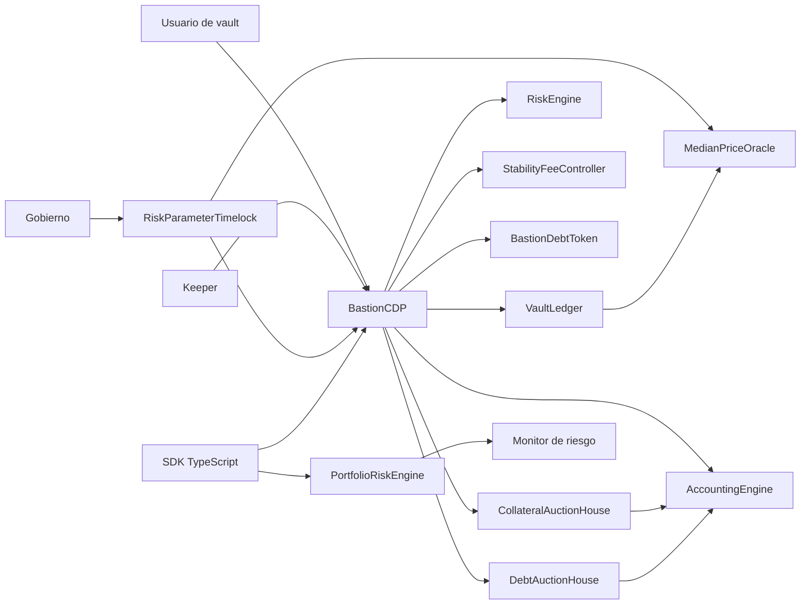
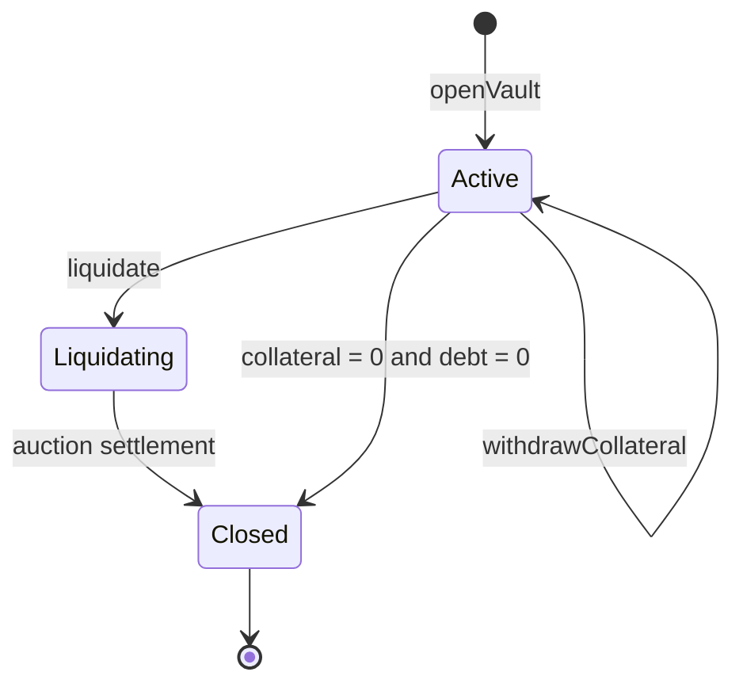
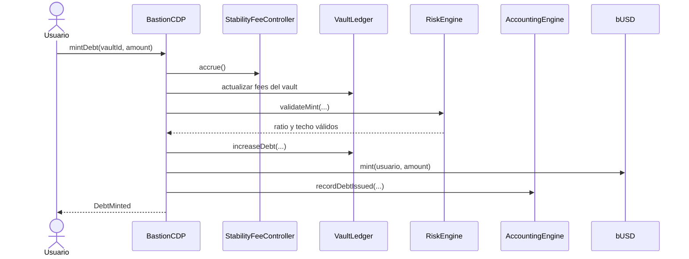
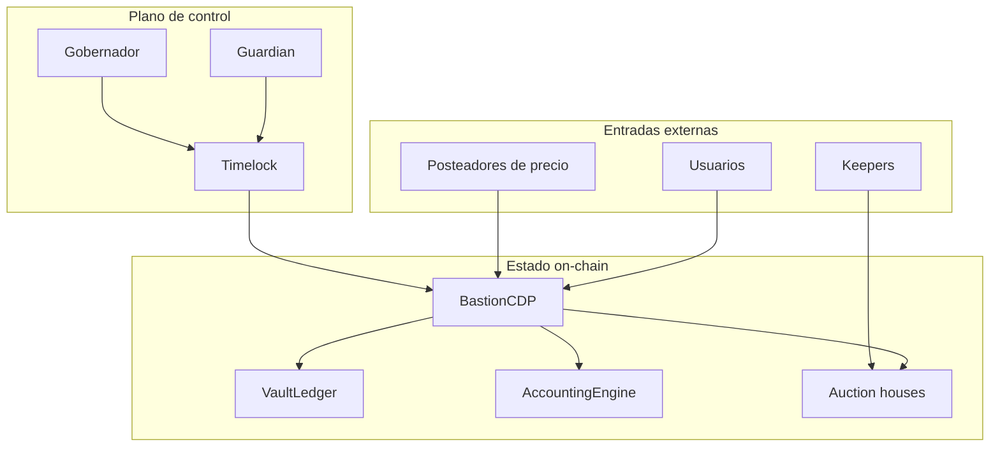

# Arquitectura de BastionCDPProtocol

## Objetivo

BastionCDPProtocol emite `bUSD` contra posiciones sobregarantizadas. La arquitectura separa
custodia, deuda, riesgo, precios, liquidaciones, subastas, contabilidad y gobierno para que cada
transición tenga un propietario claro y pueda observarse de forma independiente.

El sistema usa Solidity `0.8.26`, unidades WAD para importes y precios, RAY para índices
acumulativos y puntos básicos para ratios.

## Vista de componentes

## Responsabilidades

| Componente               | Responsabilidad                                                       | Estado que mantiene                        |
| ------------------------ | --------------------------------------------------------------------- | ------------------------------------------ |
| `BastionCDP`             | Orquestar apertura, depósito, emisión, repago, retirada y liquidación | Pausa global y referencias inmutables      |
| `VaultLedger`            | Registrar posiciones y configuración por colateral                    | Vaults, deuda, garantía, índices y estados |
| `RiskEngine`             | Validar ratios, techos y precios                                      | Sin estado                                 |
| `StabilityFeeController` | Evolucionar el índice de coste de financiación                        | Índice, tasa y último instante             |
| `AccountingEngine`       | Consolidar magnitudes del sistema                                     | Deuda, fees, bad debt y vaults             |
| `MedianPriceOracle`      | Publicar el precio vigente por activo                                 | Precio, timestamp y posteadores            |
| `CollateralAuctionHouse` | Convertir garantía liquidada en `bUSD` quemado                        | Subastas de garantía                       |
| `DebtAuctionHouse`       | Recapitalizar mediante acciones `BRS`                                 | Subastas de deuda                          |
| `PortfolioRiskEngine`    | Evaluar escenarios agregados y concentración                          | Sin estado                                 |
| `RiskParameterTimelock`  | Retardar y enlazar cambios administrativos                            | Operaciones programadas                    |

## Flujo de una posición

Cada vault conserva:

- propietario y activo de garantía;
- cantidad de garantía y deuda nominal;
- índice de fees aplicado;
- tiempos de apertura y última actualización;
- estado operativo.

## Secuencia de emisión

## Dominios numéricos

| Dominio          |       Escala | Ejemplo                         |
| ---------------- | -----------: | ------------------------------- |
| Importe y precio |   `1e18` WAD | `2_000e18` representa 2.000 USD |
| Índice           |   `1e27` RAY | `1.05e27` representa 1,05       |
| Ratio            | `10_000` BPS | `15_000` representa 150 %       |
| Tiempo           |     segundos | `365 days` para la base anual   |

Las multiplicaciones que combinan dominios pasan por `FixedPointMath.mulDiv` o `mulDivUp`. Los
cálculos de deuda exigible usan redondeo hacia arriba; las estimaciones de valor recuperable usan
redondeo hacia abajo.

## Límites de confianza

Un precio es válido sólo mientras se encuentre dentro de `maxPriceAge`. Un cambio programado es
válido sólo si coinciden target, valor, calldata, predecesor, salt, cadena y dirección del timelock.

## Invariantes arquitectónicas

1. Un vault pertenece a un único propietario y usa un único tipo de garantía.
2. La emisión no puede superar el techo del activo.
3. La retirada no puede convertir una posición con deuda en una posición por debajo del ratio
   configurado.
4. Una liquidación mueve toda la garantía al contrato de subasta antes de aceptar compras.
5. El `bUSD` usado en subastas se quema antes de considerar deuda recuperada.
6. Una operación de gobierno no puede ejecutarse antes de `readyAt` ni después de `expiresAt`.
7. Los escenarios de cartera requieren identificadores ordenados para producir resultados
   reproducibles.

## Extensión de módulos

Los módulos nuevos deben cumplir estas reglas:

- no escribir directamente en storage de otro componente;
- usar roles de propósito único;
- emitir un evento para cada transición económica;
- documentar unidad y dirección de redondeo;
- incluir tests de frontera, repetición y orden;
- mantener una interfaz de lectura que permita reconciliar ledger, supply y accounting.

## Referencias

- [Modelo económico](./modelo-economico.md)
- [Modelo de seguridad](./modelo-seguridad.md)
- [Gobierno](./gobierno.md)
- [Operaciones](./operaciones.md)
