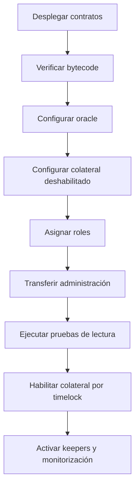

# Despliegue y release

## Toolchain fijado

| Herramienta | Versión                     |
| ----------- | --------------------------- |
| Solidity    | `0.8.26`                    |
| EVM         | `cancun`                    |
| Foundry     | `1.7.1` en validación local |
| Node.js     | `24`                        |
| npm         | `11`                        |
| TypeScript  | `5.9.3`                     |

`foundry.toml` activa optimizador con 10.000 runs, elimina metadata variable y genera storage
layout.

## Validación previa

```bash
forge fmt --check
forge build --deny warnings
FOUNDRY_PROFILE=ci forge test --deny warnings
npm ci
npm run ci:sdk
```

La ejecución local debe partir de un checkout limpio. No se reutilizan `out/`, `cache/` ni
dependencias de otra revisión.

## Variables

| Variable                | Uso                   | Valor recomendado         |
| ----------------------- | --------------------- | ------------------------- |
| `BASTION_MINIMUM_DELAY` | Delay del timelock    | `172800`                  |
| `BASTION_GRACE_PERIOD`  | Ventana de ejecución  | `604800`                  |
| `PRIVATE_KEY`           | Firma del broadcaster | proveedor externo         |
| `RPC_URL`               | Endpoint de red       | gestionado fuera del repo |

No escribas secretos en `.env` compartidos, argumentos de CI ni logs.

## Despliegue del núcleo

```bash
forge script script/DeployBastion.s.sol:DeployBastion \
  --rpc-url "$RPC_URL" \
  --broadcast \
  --verify
```

El script crea protocolo, garantía de referencia y oracle. Para un entorno existente, sustituye la
garantía de referencia por el activo aprobado y valida decimales, comportamiento ERC-20 y fuente de
precio.

## Plano de control

```bash
forge script script/DeployControlPlane.s.sol:DeployControlPlane \
  --rpc-url "$RPC_URL" \
  --broadcast \
  --verify
```

Despliega:

- `PortfolioRiskEngine`;
- `RiskParameterTimelock`;
- `BastionVersion`.

Después:

1. transferir ownership de los módulos al timelock cuando la política lo exija;
2. otorgar governor, executor y guardian a cuentas distintas;
3. revocar roles temporales del deployer;
4. financiar el timelock sólo si ejecutará llamadas con value;
5. publicar direcciones y bytecode hashes.

## Orden de configuración



No se eleva el debt ceiling antes de verificar precio, roles, balances y capacidad de liquidación.

## Verificación posterior

- `moduleAddresses()` coincide con el manifiesto;
- `BastionVersion.release()` devuelve protocolo, versión y schema esperados;
- bytecode de cada módulo coincide con el artefacto reproducible;
- owner y roles coinciden con la matriz aprobada;
- precio y timestamp del oracle son válidos;
- supply inicial de `bUSD` es el previsto;
- no existen vaults o auctions inesperados;
- escenario base produce `withinLimits = true`;
- pausa y revocación se han ensayado.

## Estrategia de release

```text
agent/<name>-production-1.0.0
        │
        ▼
pull request con CI verde
        │
        ▼
main ───────────────┐
        │            │ mismo commit
        ▼            ▼
production       v1.0.0 anotado
                     │
                     ▼
              Production 1.0.0
```

El tag debe ser anotado. `main`, `production` y el objeto pelado del tag deben resolver al mismo
SHA.

## Rollback

Los contratos desplegados no se sustituyen sólo revirtiendo Git. Una respuesta segura distingue:

- rollback de interfaz o servicio off-chain;
- pausa de rutas on-chain;
- cancelación de operaciones pendientes;
- cambio de parámetros mediante timelock;
- migración explícita de estado.

Antes de migrar, fija un bloque, inventaría posiciones, subastas, supply, garantía y roles. Toda
transferencia de custodia se ensaya con el mismo layout y un conjunto de snapshots reproducibles.

## Release reproducible

La release final exige:

1. CI verde en branch y pull request;
2. merge de revisión;
3. CI verde en `main`;
4. rama `production` en el mismo SHA y CI verde;
5. tag anotado `v1.0.0` y CI verde;
6. verificación de integridad del tag;
7. release `Production 1.0.0`;
8. verificación de integridad posterior a publicación.
