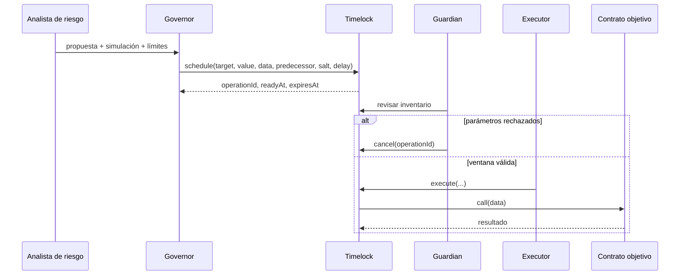
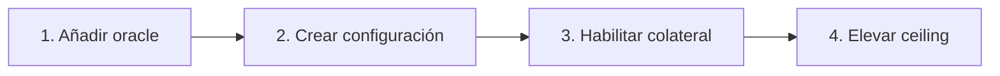

# Gobierno y cambios de parámetros

## Alcance

El plano de gobierno administra tasas, ceilings, ratios, ventanas de oracle, duraciones de subasta y
roles. `RiskParameterTimelock` convierte una intención administrativa en una operación
identificable, retardada y cancelable.

## Ciclo de cambio



## Identidad de operación

```text
operationId = keccak256(abi.encode(
    DOMAIN,
    chainId,
    timelock,
    target,
    value,
    keccak256(data),
    predecessor,
    salt
))
```

El `salt` debe derivar de un identificador de cambio estable, por ejemplo:

```text
keccak256("RISK-2026-042:WETH-LIQUIDATION-RATIO")
```

No se reutiliza un `salt` con el mismo payload. Una propuesta corregida recibe un identificador
nuevo y la anterior se cancela explícitamente.

## Tiempos

El contrato admite:

- delay mínimo entre 1 hora y 30 días;
- grace period entre 1 y 30 días;
- delay específico igual o superior al mínimo.

Política recomendada:

| Clase      | Ejemplo                                       |     Delay |
| ---------- | --------------------------------------------- | --------: |
| Operativa  | duración de auction dentro del rango aprobado |      24 h |
| Riesgo     | ratio, penalty, ceiling o tasa                |      48 h |
| Crítica    | oracle, ownership o roles de emisión          |    7 días |
| Emergencia | pausa mediante rol dedicado                   | inmediata |

La pausa no modifica parámetros económicos. La reanudación sí debe pasar por revisión e inventario
de estado.

## Predecesores

Los cambios dependientes enlazan `predecessor`:



El executor no puede saltar una dependencia. Si una operación predecesora se cancela o expira, toda
la cadena debe cancelarse y programarse de nuevo.

## Autoactualización del timelock

`updateTiming` sólo acepta llamadas cuyo `msg.sender` sea el propio timelock. Por tanto, cambiar
delay o grace period exige programar una llamada al mismo contrato y respetar la configuración
vigente.

Ejemplo Foundry:

```solidity
bytes memory data = abi.encodeCall(timelock.updateTiming, (3 days, 10 days));
bytes32 salt = keccak256("GOV-TIMING-V2");
timelock.schedule(address(timelock), 0, data, bytes32(0), salt, 2 days);
```

## Revisión previa

Cada cambio debe incluir:

1. estado actual y estado propuesto;
2. motivación cuantitativa;
3. impacto en deuda máxima y liquidaciones;
4. escenario base, adverso y extremo;
5. calldata decodificada;
6. `operationId` calculado de forma independiente;
7. bloque y ventana prevista;
8. criterio de cancelación;
9. observación posterior.

## Matriz de aprobación

| Cambio        | Riesgo                          | Datos mínimos                       |
| ------------- | ------------------------------- | ----------------------------------- |
| Tasa anual    | Carry y demanda de `bUSD`       | utilización, peg, fees proyectadas  |
| Debt ceiling  | Exposición máxima               | liquidez, HHI, cobertura stressed   |
| Ratio         | Liquidaciones y capital         | volatilidad, slippage, profundidad  |
| Penalty       | Recuperación y coste de usuario | cobertura histórica de auctions     |
| `maxPriceAge` | Calidad de precio               | frecuencia y disponibilidad         |
| Close factor  | Velocidad de reducción          | tamaño de vaults y capacidad keeper |

## Cancelación

El guardian cancela cuando:

- el calldata no coincide con la propuesta aprobada;
- la simulación se ejecutó con un estado obsoleto;
- el precio, liquidez o concentración cambiaron materialmente;
- se perdió una dependencia;
- el executor o target no coincide con el inventario;
- aparece una incidencia durante la espera.

Cancelar no borra el historial. El estado permanece como `Cancelled` y no puede reactivarse.

## Ejecución

Antes de ejecutar:

```text
stateOf(operationId) == Ready
block.timestamp <= expiresAt
target y value coinciden
keccak256(data) coincide
predecessor == 0 o predecessor ejecutado
saldo ETH del timelock >= value
```

Después:

- verificar evento `OperationExecuted`;
- verificar evento del contrato objetivo;
- leer el parámetro resultante;
- recalcular escenarios de riesgo;
- observar al menos un ciclo operativo completo;
- archivar tx hash, bloque y métricas.

## Respuesta de emergencia

El guardian puede cancelar, pero no ejecutar. El pauser puede detener rutas que usen
`whenNotPaused`. La respuesta prioriza contener nuevas emisiones y retiradas sensibles, mantener
lecturas disponibles y conservar los eventos para reconciliación.
