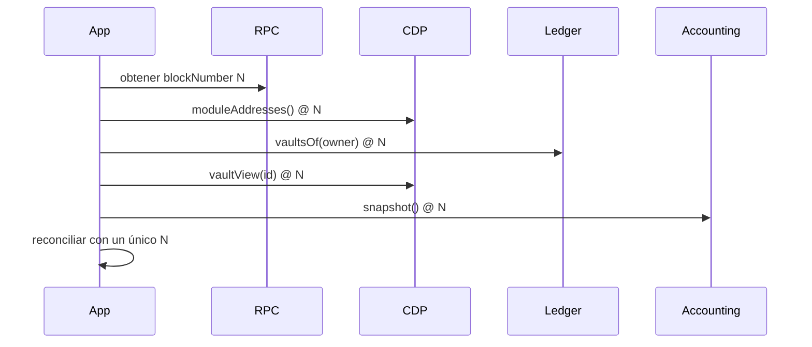

# Integración

## Requisitos

- Node.js 24 y npm 11 para el SDK;
- un adaptador de lectura compatible con `readContract`;
- direcciones verificadas del protocolo;
- soporte nativo de `bigint`;
- block tag explícito para snapshots reproducibles.

## Instalación local

```bash
npm ci
npm run build:sdk
npm run test:sdk
```

El SDK no fuerza una librería RPC. El integrador adapta viem, ethers o un servicio interno a esta
interfaz:

```ts
interface ContractReader {
  readContract<T>(request: ReadContractRequest): Promise<T>;
}
```

## Cliente

```ts
import { BastionClient, type Address } from "./sdk/BastionClient.js";

const protocol = "0x1111111111111111111111111111111111111111" as Address;
const client = new BastionClient(protocol, reader);

const view = await client.vaultView(42n);
const system = await client.systemSnapshot();
const ownerVaults = await client.vaultIdsOf(account);
```

`systemSnapshot()` resuelve primero `moduleAddresses()` y después consulta el accounting.
`vaultIdsOf()` resuelve el ledger de la misma forma. Esto evita duplicar direcciones de módulos en
configuración externa.

## Aritmética exacta

No conviertas importes on-chain a `number`.

```ts
import { formatUnits, parseUnits } from "./sdk/BastionClient.js";

const debt = parseUnits("10500.25");
console.log(formatUnits(debt)); // 10500.25
```

Funciones disponibles:

- `mulDiv` y `mulDivUp`;
- `ratioBps`;
- `accrueLinear` y `accruedFromIndex`;
- `liquidationDebt` y `liquidationPrice`;
- `collateralValue` y `stressedPrice`;
- `evaluatePortfolio`;
- `serializeBigInts`.

## Evaluación de cartera

```ts
import { BPS, WAD, evaluatePortfolio } from "./sdk/BastionClient.js";

const result = evaluatePortfolio(
  [
    {
      collateralId: "0x0000000000000000000000000000000000000000000000000000000000000001",
      collateralAmount: 10n * WAD,
      spotPrice: 2000n * WAD,
      debt: 10_000n * WAD,
      debtCeiling: 50_000n * WAD,
      liquidationRatioBps: 15_000n,
      liquidationPenaltyBps: 1300n,
      liquidityScoreBps: 0n,
      oracleConfidenceBps: BPS,
    },
  ],
  {
    priceShockBps: 2000n,
    liquidityHaircutBps: 1000n,
    oracleDeviationBps: 0n,
    debtGrowthBps: 500n,
    auctionSlippageBps: 500n,
  },
  {
    maxSingleDebtShareBps: BPS,
    maxDebtHhiBps: BPS,
    maxCollateralHhiBps: BPS,
    minStressedCoverageBps: 15_000n,
    maxDebtCeilingUtilizationBps: 9000n,
  },
);

console.log(result.portfolio.totalShortfall);
```

Los `collateralId` deben tener 32 bytes y orden lexicográfico ascendente. Esta regla coincide con el
contrato y evita resultados dependientes de un orden accidental.

## Snapshot coherente



Todas las lecturas de una vista deben usar el mismo block tag. Mezclar bloques puede mostrar supply,
deuda o auction en fases distintas de una transición.

## Estados y errores

Mapeo recomendado:

| Estado        | Presentación                          |
| ------------- | ------------------------------------- |
| `None`        | posición no inicializada              |
| `Active`      | operaciones de usuario disponibles    |
| `Liquidating` | garantía gestionada por auction house |
| `Closed`      | posición finalizada                   |

Los errores custom deben decodificarse por selector. La interfaz no debe reintentar automáticamente
errores de permisos, estado o ratio. Los reintentos sólo aplican a fallos de transporte
idempotentes.

## Preparación de transacciones

Antes de firmar:

1. simular contra el bloque más reciente;
2. mostrar importe raw y formateado;
3. mostrar deuda, fee y ratio posteriores;
4. fijar chain id, target y función;
5. limitar allowance al importe necesario;
6. comprobar expiración de la cotización;
7. volver a simular si cambia el bloque de referencia.

## Serialización

`JSON.stringify` no acepta `bigint` por defecto. Usa:

```ts
import { serializeBigInts } from "./sdk/BastionClient.js";

const payload = serializeBigInts(result);
```

Los importes se serializan como strings decimales sin exponente.

## Compatibilidad

La versión `1.0.0` usa schema `bastion-cdp/v1`. Un consumidor debe registrar ambos valores con cada
snapshot. Un cambio incompatible requiere un schema nuevo, aunque mantenga direcciones de contratos.
