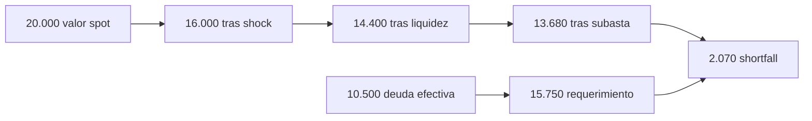

# Modelo económico

## Unidades y convenciones

BastionCDPProtocol expresa tokens y precios en WAD (`10^18`), índices en RAY (`10^27`) y parámetros
relativos en puntos básicos (`10.000 = 100 %`). En este documento, `C` es la cantidad de garantía,
`P` su precio, `D` la deuda y `r` el ratio de liquidación.

## Valor de garantía

El valor spot es:

```text
V_spot = floor(C × P / WAD)
```

Una posición cumple el ratio si:

```text
V_spot × BPS >= D × r
```

La deuda máxima admisible es:

```text
D_max = floor(V_spot × BPS / r)
```

Para `10 bETH`, precio `2.000 USD` y ratio `150 %`:

```text
V_spot = 20.000 bUSD
D_max  = 13.333,333333333333333333 bUSD
```

## Precio de liquidación

El precio que hace exacto el umbral se redondea hacia arriba:

```text
P_liq = ceil(ceil(D × r / BPS) × WAD / C)
```

Con `3 bETH`, deuda `1.000 bUSD` y ratio `150 %`, el precio de liquidación es `500 USD/bETH`.

## Índice de stability fee

La evolución lineal del índice es:

```text
I_t = I_0 + floor(I_0 × tasa_bps × Δt / (BPS × YEAR))
```

La deuda indexada y el fee pendiente son:

```text
D_indexada = ceil(D × I_t / I_vault)
fee         = D_indexada - D
```

Ejemplo anual con deuda `10.000 bUSD` y tasa `500 bps`:

```text
I_0         = 1,00 RAY
I_t         = 1,05 RAY
fee         = 500 bUSD
deuda total = 10.500 bUSD
```

## Deuda de liquidación

La penalización compensa ejecución, slippage y coste operativo:

```text
D_liq = D + ceil(D × penalty_bps / BPS)
```

Para `10.000 bUSD` y `1.300 bps`, la subasta intenta recuperar `11.300 bUSD`.

## Subasta de garantía

La subasta mantiene dos saldos:

- `collateralRemaining`;
- `debtRemaining`.

Una compra quema `debtPaid` y entrega la garantía cotizada. La reconciliación por subasta debe
conservar:

```text
debtRecovered = initialDebt - debtRemaining
collateralSold = initialCollateral - collateralRemaining
```

Cuando cualquiera de los saldos llega a cero, la subasta pasa a `Settled`. El remanente de garantía
sólo puede salir por una transición explícita.

## Subasta de deuda

Si el sistema mantiene bad debt, el plano de recapitalización ofrece un lote de `BRS` a cambio de
`bUSD`. Los bids reducen su importe según `minIncreaseBps`; el ganador paga `bUSD`, que se quema, y
recibe el lote de acciones.

El operador debe observar por separado:

- deuda pendiente de recuperación;
- supply de `bUSD`;
- dilución potencial de `BRS`;
- cobertura prevista de la subasta;
- tiempo restante y liquidez de bidders.

## Stress secuencial

`PortfolioRiskEngine` aplica haircuts de forma secuencial. Esto evita sumar porcentajes sobre bases
distintas:

```text
P_1      = P_spot × (1 - shock)
P_2      = P_1 × (1 - haircut_liquidez_efectivo)
P_3      = P_2 × (1 - desviacion_oracle_efectiva)
P_stress = P_3 × (1 - slippage_subasta)
```

Los ajustes efectivos dependen de la calidad observada:

```text
haircut_liquidez_efectivo = haircut × (BPS - liquidityScore) / BPS
desviacion_oracle_efectiva = deviation × (BPS - oracleConfidence) / BPS
```

Ejemplo conservador:

| Parámetro            |     Valor |
| -------------------- | --------: |
| Precio spot          | 2.000 USD |
| Shock                |      20 % |
| Haircut de liquidez  |      10 % |
| Slippage de subasta  |       5 % |
| Crecimiento de deuda |       5 % |

Con score de liquidez cero y confianza de oracle completa:

```text
P_stress       = 2.000 × 0,80 × 0,90 × 0,95 = 1.368 USD
V_stress       = 10 × 1.368 = 13.680 bUSD
D_effective    = 10.000 × 1,05 = 10.500 bUSD
requerimiento  = 10.500 × 1,50 = 15.750 bUSD
shortfall      = 15.750 - 13.680 = 2.070 bUSD
```



## Concentración

La concentración se calcula con Herfindahl-Hirschman:

```text
share_i = exposure_i / totalExposure
HHI     = Σ share_i²
```

En BPS, un único activo produce `10.000`; dos activos al 50 % producen `5.000`; cuatro activos al 25
% producen `2.500`. Se calculan HHI separados para deuda y valor de garantía.

## Score agregado

El score suma, con techo de `10.000`, las desviaciones de:

- shortfall frente al requerimiento total;
- HHI de deuda;
- HHI de garantía;
- mayor participación individual;
- cobertura stressed mínima;
- utilización máxima de debt ceilings.

`withinLimits` sólo es verdadero cuando no existe shortfall y cada límite se cumple simultáneamente.

## Reconciliación económica

| Magnitud                | Fuente primaria                  | Comparación operativa                    |
| ----------------------- | -------------------------------- | ---------------------------------------- |
| Supply de `bUSD`        | `BastionDebtToken.totalSupply()` | Deuda abierta menos recuperación quemada |
| Deuda normalizada       | `AccountingEngine`               | Suma por colateral                       |
| Garantía custodiada     | Balance ERC-20 de `BastionCDP`   | Suma de vaults activos                   |
| Garantía en liquidación | Balance de auction house         | Suma de subastas live                    |
| Bad debt                | `badDebtByCollateral`            | Deuda no cubierta por garantía           |
| Fees                    | `feesByCollateral`               | Incrementos materializados por índice    |

Las alertas no deben depender de una sola igualdad. El runbook compara ledger, supply, balances,
subastas y eventos dentro del mismo bloque.

## Escenarios mínimos de riesgo

1. Precio estable y crecimiento de deuda cero.
2. Shock del 20 % con liquidez normal.
3. Shock del 35 %, oracle degradado y slippage del 10 %.
4. Utilización del 90 % del techo por un solo colateral.
5. Dos activos correlacionados con concentración 50/50.
6. Deuda cero para comprobar tratamiento de cobertura no acotada.
