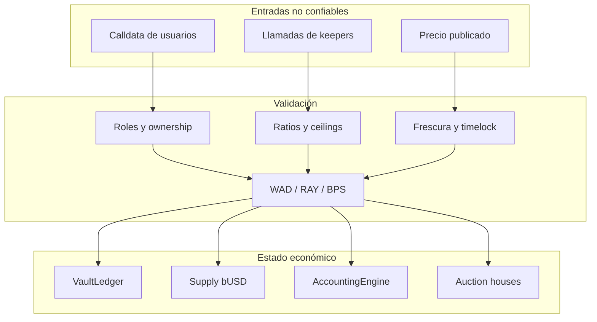
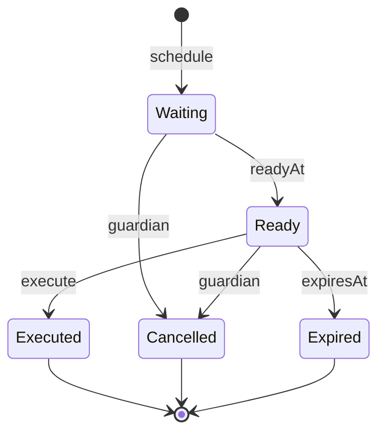

# Modelo de seguridad

## Principios

La seguridad de BastionCDPProtocol se apoya en separación de funciones, transiciones observables,
precios con caducidad, límites económicos y cambios administrativos retardados. Ningún control
aislado sustituye la reconciliación entre deuda, supply, garantía y accounting.

## Activos protegidos

- garantía depositada en vaults;
- supply y capacidad de emisión de `bUSD`;
- garantía transferida a subastas;
- acciones `BRS` emitidas en recapitalizaciones;
- configuraciones de colateral y oracle;
- roles administrativos;
- continuidad de los keepers;
- integridad del historial de operaciones programadas.

## Actores

| Actor         | Capacidad                                  | Restricción principal            |
| ------------- | ------------------------------------------ | -------------------------------- |
| Usuario       | Gestionar sus vaults                       | Propiedad y ratio de salud       |
| Keeper        | Iniciar liquidaciones y finalizar subastas | Estado y tiempos on-chain        |
| Risk manager  | Proponer parámetros                        | Timelock y límites válidos       |
| Governor      | Programar cambios                          | Delay mínimo y calldata enlazado |
| Executor      | Ejecutar cambios listos                    | Ventana y predecesores           |
| Guardian      | Cancelar operaciones                       | No puede ejecutarlas             |
| Oracle poster | Publicar precios                           | Rol dedicado y frescura          |
| Admin         | Gestionar roles                            | Custodia multisig recomendada    |

## Fronteras de confianza



## Controles de acceso

`BastionAccessControl` asigna roles independientes. El propietario inicial dispone de la
administración y debe transferirse a una cuenta con política multifirma. Las cuentas operativas no
deben mantener el rol de administración.

Separación recomendada:

- `DEFAULT_ADMIN_ROLE`: multisig fría;
- `GOVERNOR_ROLE`: multisig de riesgo;
- `EXECUTOR_ROLE`: automatización limitada;
- `GUARDIAN_ROLE`: multisig de respuesta;
- `ORACLE_POSTER_ROLE`: servicio de precios;
- `PAUSER_ROLE`: guardia operativa;
- `AUCTIONEER_ROLE`: keeper de recapitalización.

## Gobierno con retardo

El identificador de una operación enlaza:

```text
DOMAIN
chainId
timelock address
target
ETH value
keccak256(calldata)
predecessor
salt
```

Una mutación de cualquier campo produce otro identificador. La ejecución exige estado `Ready`; se
marca `executed` antes de la llamada externa y toda la transacción revierte si el target falla.



## Riesgo de oracle

`RiskEngine.priceOf` rechaza:

- colateral deshabilitado;
- precio cero;
- precio anterior a `maxPriceAge`.

La operación recomienda además:

- dos fuentes independientes fuera de cadena;
- límites de variación por intervalo;
- alertas por dispersión;
- pausa de emisión ante pérdida de quorum;
- escenario stressed con `oracleConfidenceBps` reducido.

## Llamadas externas

Las rutas de depósito, repago, retirada, liquidación y subasta usan guardia de reentrada cuando
transfieren tokens. El orden esperado es:

1. validar actor, estado e importe;
2. calcular valores en memoria;
3. actualizar el estado propio;
4. ejecutar transferencia o burn;
5. registrar accounting y emitir eventos.

Los tokens admitidos deben respetar semántica ERC-20 conocida. Activos con fee on transfer, rebasing
o callbacks requieren una integración específica.

## Invariantes de alto valor

```text
collateral activo + collateral en subasta <= balances custodiados
deuda por colateral <= debt ceiling configurado
deuda de un vault activo = 0 o deuda >= minDebt
precio usado.timestamp + maxPriceAge >= block.timestamp
debtRecovered <= initialDebt de la subasta
operación ejecutada => operación programada y dentro de ventana
```

La CI incluye casos unitarios, integración, fuzzing configurado y escenarios de frontera. Para
revisiones de cambios sensibles deben añadirse invariantes stateful que combinen emisión, tiempo,
liquidación y settlement.

## Riesgos operativos

| Riesgo                  | Señal                              | Respuesta                             |
| ----------------------- | ---------------------------------- | ------------------------------------- |
| Precio estancado        | edad próxima a `maxPriceAge`       | detener emisión y revisar posteadores |
| Concentración           | HHI o share máximo fuera de límite | reducir ceiling o aumentar ratio      |
| Cobertura stressed baja | `withinLimits = false`             | bloquear expansión de deuda           |
| Subasta sin bids        | tiempo restante bajo               | activar participantes de respaldo     |
| Bad debt creciente      | recuperación menor que entrada     | preparar debt auction                 |
| Cambio inesperado       | operation id no inventariado       | cancelar y rotar permisos             |

## Gestión de claves

- no guardar claves en el repositorio;
- usar proveedores de firma separados para governor, guardian y oracle;
- rotar posteadores sin reutilizar seeds;
- probar revocación antes de cada release;
- mantener una cuenta de recuperación fuera del flujo diario;
- registrar cada cambio de rol en el inventario operativo.

## Validación de release

Una versión se considera válida cuando:

- `forge fmt`, build y tests pasan con warnings denegados;
- el SDK pasa formato, tipos y tests;
- `main`, `production` y el tag anotado resuelven al mismo commit;
- el tag declara `1.0.0` tanto en package como en contrato de versión;
- la release no es draft ni prerelease;
- el workflow de integridad finaliza correctamente.
