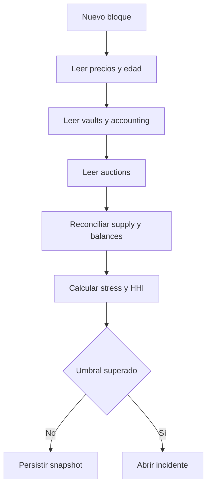
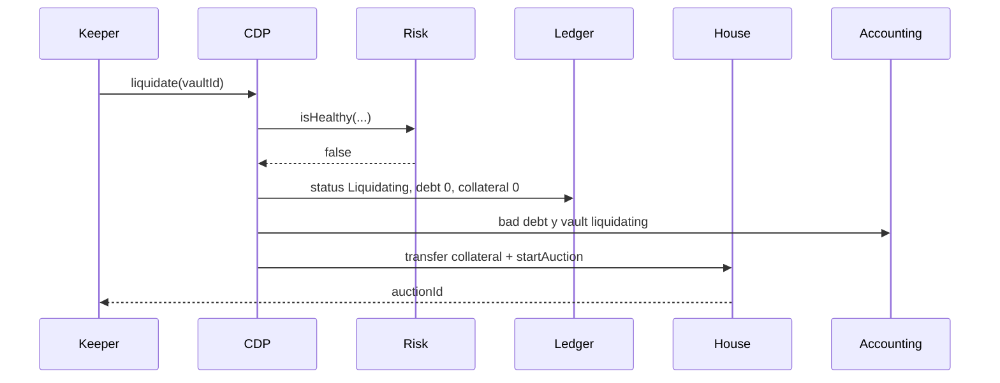

# Operaciones

## Objetivo operativo

Este runbook cubre apertura, precios, emisión, liquidaciones, subastas, reconciliación y respuesta.
Las acciones administrativas se realizan mediante cuentas separadas y se verifican con lecturas
on-chain independientes.

## Puesta en servicio

1. Verificar direcciones de `BastionCDP`, ledger, accounting, tokens y houses.
2. Confirmar owner y roles efectivos.
3. Comprobar tasa, índice y `lastAccrued`.
4. Leer todos los collaterals listados y sus oracles.
5. Confirmar balances de garantía en protocolo y subastas.
6. Ejecutar un escenario stressed y guardar su digest.
7. Verificar que los keepers pueden simular, pero no administrar.
8. Confirmar `main`, `production` y tag de la versión desplegada.

## Rutina por bloque



## Métricas

| Métrica                     | Fuente            | Alerta sugerida                  |
| --------------------------- | ----------------- | -------------------------------- |
| Edad de precio              | oracle            | 70 % de `maxPriceAge`            |
| Utilización de ceiling      | accounting/config | 80 % aviso, 90 % crítica         |
| Cobertura stressed          | risk engine       | menor al límite aprobado         |
| HHI de deuda                | portfolio risk    | mayor al límite aprobado         |
| Largest debt share          | portfolio risk    | mayor a 60 %                     |
| Bad debt abierto            | accounting        | crecimiento entre snapshots      |
| Recuperación de auctions    | house/accounting  | menor a objetivo                 |
| Auctions próximas a expirar | house             | menos de 15 min                  |
| Divergencia supply/deuda    | token/accounting  | cualquier variación no explicada |

## Apertura y emisión

Checklist de observación:

- colateral habilitado;
- precio fresco y no cero;
- depósito confirmado por balance;
- deuda final mayor o igual al mínimo;
- ceiling suficiente;
- ratio posterior dentro de política;
- eventos `VaultOpened`, `CollateralDeposited` y `DebtMinted` coherentes;
- supply incrementado por el importe emitido.

## Repago y retirada

El operador registra:

- deuda e índice antes de la transacción;
- fee pendiente estimado;
- cantidad quemada;
- deuda e índice después;
- supply después del burn;
- garantía transferida y balance final;
- eventos de ledger y accounting.

No se considera suficiente observar sólo `DebtRepaid`: la conciliación incluye el balance de tokens
y la posición final.

## Liquidación



Verificar que la garantía salió del protocolo y llegó al house en la misma transacción. La deuda
objetivo debe incluir la penalización configurada.

## Gestión de subastas

Durante una subasta live:

1. leer `debtRemaining` y `collateralRemaining`;
2. calcular coste de compra y slippage;
3. verificar supply antes y después de cada burn;
4. confirmar `recordDebtRecovered` por el mismo importe;
5. vigilar tiempo restante;
6. registrar causa del settlement: deuda cero, garantía cero o expiración.

Si expira con garantía restante, verificar destinatario y cantidad exacta del remanente.

## Reconciliación

Por colateral:

```text
garantía observada = balance protocolo + balance house
deuda observada    = normalizedDebtByCollateral
recuperación neta  = recoveredDebtByCollateral
bad debt abierto   = badDebtByCollateral
```

Global:

```text
Σ deuda por colateral = totalNormalizedDebt
Σ bad debt por colateral = totalBadDebt
Σ recuperación por colateral = totalRecoveredDebt
active + liquidating + closed = vaults creados observados
```

Las diferencias se explican con un rango de bloques y eventos; nunca se corrigen mediante ajustes
manuales sin una transición on-chain identificable.

## Niveles de incidente

| Nivel | Ejemplo                                               | Acción inmediata                              |
| ----- | ----------------------------------------------------- | --------------------------------------------- |
| S1    | pérdida de control de admin o emisión no inventariada | pausar, cancelar cambios, preservar evidencia |
| S2    | precio degradado o divergencia económica              | detener expansión, aislar colateral           |
| S3    | keeper retrasado o auction sin bids                   | activar respaldo y elevar observación         |
| S4    | métrica próxima a umbral                              | seguimiento y propuesta de ajuste             |

## Procedimiento de incidente

1. fijar bloque de referencia;
2. capturar configuración, roles, balances, supply y snapshots;
3. pausar sólo las rutas necesarias;
4. cancelar operaciones de gobierno pendientes relacionadas;
5. identificar rango de bloques afectado;
6. reconciliar eventos y estado;
7. simular la recuperación;
8. ejecutar mediante timelock cuando corresponda;
9. verificar estado posterior;
10. publicar un informe operativo sin secretos.

## Cierre diario

- snapshot de accounting;
- inventario de operations del timelock;
- collaterals y oracles activos;
- auctions live y expiradas;
- digest del escenario stressed;
- divergencias justificadas;
- acciones pendientes con propietario y plazo.
